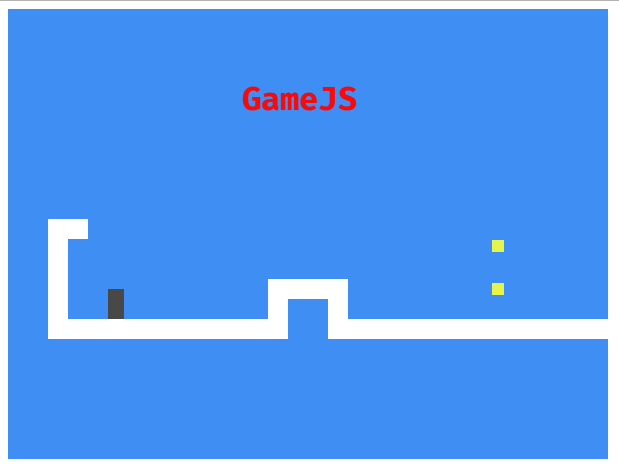

# GameJS

_GameJS_ es un juego creado con Javascript vanilla ES6, creado como parte del aprendizaje del curso Javascript desde 0 de keepcoding.

- Este juego cuenta con niveles.
- Motor de colisiones muy básico.
- Recolección de monedas para lograr un nivel.

>Actualmente está en desarrollo.